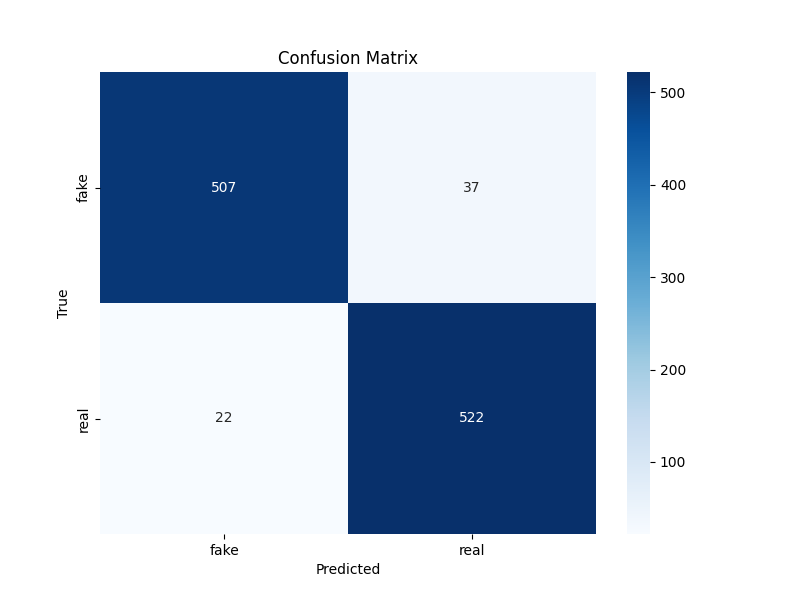

# Synthetic Audio Detector

## About

A synthetic audio detector built in Python.

**Libraries Used:**
- `tensorflow` for building the model.
- `scikit-learn` for Data Analysis and implementing Machine Learning concepts.
- `numpy` for data handling.
- `matplotlib` and `seaborn` for Data Visualization.

**Dataset Used:**
The 2 seconds version of the [Fake or Real (FoR)](https://www.kaggle.com/datasets/mohammedabdeldayem/the-fake-or-real-dataset?resource=download-directory) dataset which aggregates real and synthetic audio from various sources.

## Content

- The `main.ipynb` directory documents the entire model creation process and all that it entails.
- The `model` directory contains the best model for the audio classification task. It also contains the label encoder and training history files.
- The `src` directory contains assets for this repository.

## Benchmark (as of 02-04-2025)

- **Accuracy**     :   **91.72**
- **AUC**          :   **96.41**
- **Precision**    :   **91.72**
- **Recall**       :   **91.72**
- **Loss**         :   **0.24**

## Future Plans

- A frontend interface for users to test out their provided 2 second audio clips and classify them as natural or synthetic